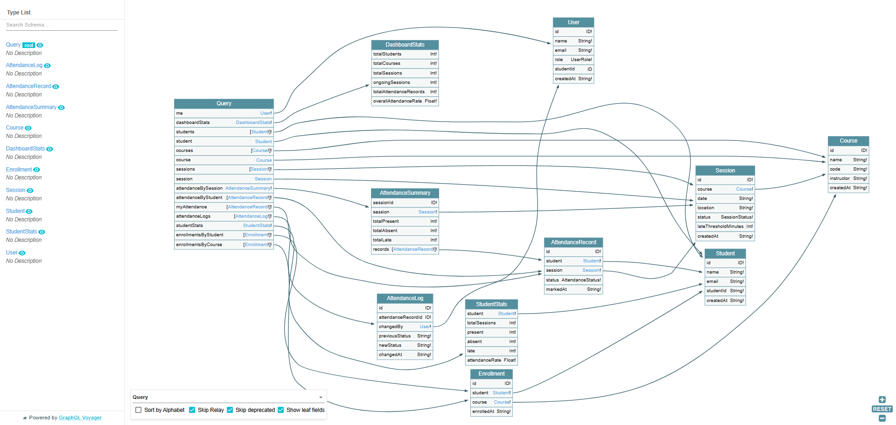
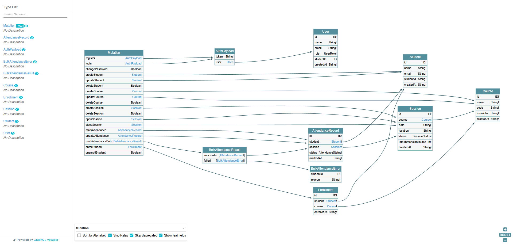
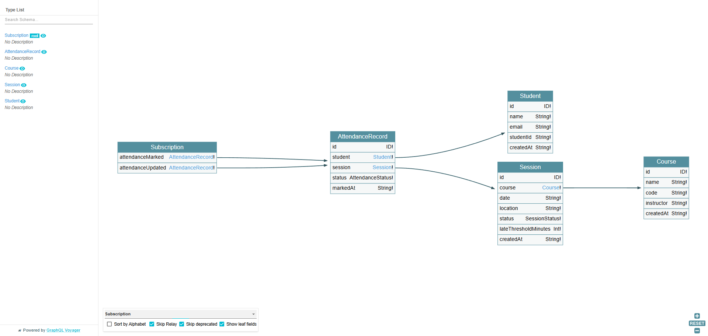

# Real-time Attendance System

A distributed GraphQL-based attendance tracking system built with Apollo Server 4, WebSocket subscriptions, MongoDB, and JWT authentication.

---

## Features

- **GraphQL API** — queries, mutations, and real-time subscriptions over a single endpoint
- **WebSocket subscriptions** — live attendance events pushed to connected clients via `graphql-ws`
- **JWT authentication** — role-based access control (TEACHER / STUDENT)
- **Session lifecycle** — UPCOMING → ONGOING → CLOSED state machine
- **Auto late detection** — configurable threshold per session
- **Enrollment validation** — attendance only for enrolled students
- **Bulk attendance marking** — mark entire class at once
- **Attendance correction audit log** — every correction is tracked
- **Excel export** — color-coded `.xlsx` reports for sessions and student stats
- **Browser client** — role-aware UI with smart dropdowns, live feed, and toast notifications
- **GraphQL Voyager** — interactive schema explorer at `/voyager`

---

## Tech Stack

| Layer           | Technology                                 |
| --------------- | ------------------------------------------ |
| Runtime         | Node.js 22 + TypeScript 5                  |
| GraphQL Server  | Apollo Server 4 + Express 4                |
| Real-time       | `graphql-ws` + `WebSocketServer`           |
| Database        | MongoDB Atlas + Mongoose 8                 |
| Authentication  | JWT (`jsonwebtoken`) + `bcryptjs`          |
| Event Bus       | `graphql-subscriptions` (in-memory PubSub) |
| Export          | ExcelJS (`.xlsx`)                          |
| Schema Explorer | GraphQL Voyager at `/voyager`              |
| Client          | HTML / JS ES Modules (`npx serve client`)  |

---

## Setup

### 1. Install dependencies

```bash
npm install
```

### 2. Configure environment

```bash
cp .env.example .env
```

Edit `.env`:

```env
MONGODB_URI=mongodb+srv://<user>:<password>@cluster0.xxxxx.mongodb.net/attendance?retryWrites=true&w=majority
PORT=4000
JWT_SECRET=your_super_secret_key_here
```

### 3. Seed sample data

```bash
npm run seed
```

This creates 3 courses (PROG4, ML301, DM201), 8 students, 10 sessions (7 CLOSED with attendance records + 3 UPCOMING), and 43 attendance records.

Pre-seeded credentials (password: `password123`):

| Role    | Email          |
| ------- | -------------- |
| TEACHER | martin@ufaz.az |
| STUDENT | elvin@ufaz.az  |

### 4. Start the server

```bash
npm run dev        # development with hot reload
npm run build      # compile TypeScript
npm start          # production
```

### 5. Start the client

```bash
npx serve client
```

Open [http://localhost:3000](http://localhost:3000)

---

## Endpoints

| Endpoint                                   | Description                            |
| ------------------------------------------ | -------------------------------------- |
| `http://localhost:4000/graphql`            | GraphQL API + Apollo Sandbox           |
| `ws://localhost:4000/graphql`              | WebSocket subscriptions                |
| `http://localhost:4000/voyager`            | Interactive schema explorer            |
| `http://localhost:4000/health`             | Health check                           |
| `http://localhost:4000/export/stats`       | Download all student stats as `.xlsx`  |
| `http://localhost:4000/export/session/:id` | Download session attendance as `.xlsx` |

---

## Authentication

All operations except `login` and `register` require a Bearer token.

**Register (teachers only):**

```graphql
mutation {
  register(name: "Prof. Martin", email: "martin@ufaz.az", password: "pass123") {
    token
    user {
      id
      name
      role
    }
  }
}
```

**Login:**

```graphql
mutation {
  login(email: "martin@ufaz.az", password: "pass123") {
    token
    user {
      id
      name
      role
    }
  }
}
```

```
Authorization: Bearer <token>
```

> Students do not self-register. A teacher creates their account via `createStudent`, which atomically creates both the academic record and login credentials.

---

## Roles

| Role      | Access                                                                             |
| --------- | ---------------------------------------------------------------------------------- |
| `TEACHER` | Full access — manage students, courses, sessions, attendance, enrollments, exports |
| `STUDENT` | Read-only — `myAttendance`, own `studentStats`, courses, sessions, live feed       |

---

## GraphQL Schema

### Queries

```graphql
me: User!
dashboardStats: DashboardStats!
students(limit: Int, offset: Int): [Student!]!
courses(limit: Int, offset: Int): [Course!]!
sessions(courseId: ID, status: SessionStatus, limit: Int, offset: Int): [Session!]!
attendanceBySession(sessionId: ID!): AttendanceSummary!
attendanceByStudent(studentId: ID!): [AttendanceRecord!]!
myAttendance(limit: Int, offset: Int): [AttendanceRecord!]!
attendanceLogs(attendanceRecordId: ID!): [AttendanceLog!]!
studentStats(studentId: ID!): StudentStats!
enrollmentsByStudent(studentId: ID!): [Enrollment!]!
enrollmentsByCourse(courseId: ID!): [Enrollment!]!
```

### Mutations

```graphql
# Auth
register(name, email, password): AuthPayload!
login(email, password): AuthPayload!
changePassword(oldPassword, newPassword): Boolean!

# Students — also creates login account
createStudent(name, email, studentId, password): Student!
updateStudent(id, name?, email?, studentId?): Student!
deleteStudent(id): Boolean!

# Courses
createCourse(name, code, instructor): Course!
updateCourse(id, name?, code?, instructor?): Course!
deleteCourse(id): Boolean!

# Sessions
createSession(courseId, date, location, lateThresholdMinutes?): Session!
openSession(id): Session!     # UPCOMING → ONGOING
closeSession(id): Session!    # ONGOING  → CLOSED
deleteSession(id): Boolean!

# Attendance (session must be ONGOING)
markAttendance(studentId, sessionId, status?): AttendanceRecord!
markAttendanceBulk(sessionId, records: [BulkAttendanceInput!]!): BulkAttendanceResult!
updateAttendance(id, status): AttendanceRecord!

# Enrollment
enrollStudent(studentId, courseId): Enrollment!
unenrollStudent(studentId, courseId): Boolean!
```

### Subscriptions

```graphql
# Live events for a specific session
subscription ($sessionId: ID!) {
  attendanceMarked(sessionId: $sessionId) {
    id
    status
    markedAt
    student {
      name
      studentId
    }
    session {
      date
      location
    }
  }
}

# Live events across all sessions
subscription {
  attendanceUpdated {
    id
    status
    markedAt
    student {
      name
      studentId
    }
    session {
      date
      location
    }
  }
}
```

---

## Session Lifecycle

```
UPCOMING ──→ openSession() ──→ ONGOING ──→ closeSession() ──→ CLOSED
```

- Attendance can only be marked when a session is `ONGOING`
- If `status` is omitted, the system auto-detects: elapsed time > `lateThresholdMinutes` → `LATE`, otherwise → `PRESENT`
- `ABSENT` must always be set explicitly

---

## Architecture

```
Client (HTTP)              Client (WebSocket)
      │                           │
      ▼                           ▼
Apollo Server 4           graphql-ws Server
      │                           │
      └─────────────┬─────────────┘
                    │
             GraphQL Schema
          (typeDefs + resolvers)
                    │
          ┌─────────┼─────────┐
          │         │         │
       MongoDB    PubSub     JWT
      (Mongoose) (events)   (auth)
                    │
         fires on markAttendance
         → broadcasts to all
           subscribed clients
```

Both Apollo Server (HTTP) and graphql-ws (WebSocket) share the same schema and resolvers. When `markAttendance` is called, the resolver publishes to the in-memory PubSub bus, which immediately delivers the event to all active subscription clients filtered by `sessionId`.

---

## GraphQL Voyager — Schema Explorer

Visit `http://localhost:4000/voyager` to explore the full schema visually.

### Queries & Types



### Mutations



### Subscriptions



---

## Project Structure

```
├── client/                  # Browser client (ES Modules)
│   ├── index.html
│   └── js/
│       ├── api.js           # GraphQL HTTP + REST calls
│       ├── app.js           # Event handlers and navigation
│       ├── ui.js            # DOM rendering functions
│       ├── subscription.js  # WebSocket subscription client
│       └── toast.js         # Toast notification system
├── public/                  # Voyager screenshots
├── scripts/
│   └── seed.ts              # Database seeder
├── src/
│   ├── graphql/
│   │   ├── resolvers/       # Query, Mutation, Subscription resolvers
│   │   └── typeDefs/        # GraphQL schema definition
│   ├── models/              # Mongoose models
│   └── utils/               # auth, db, export, pubsub
├── .env.example
└── tsconfig.json
```

---

## License

MIT
